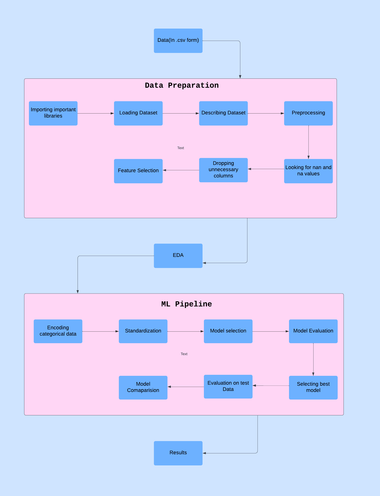
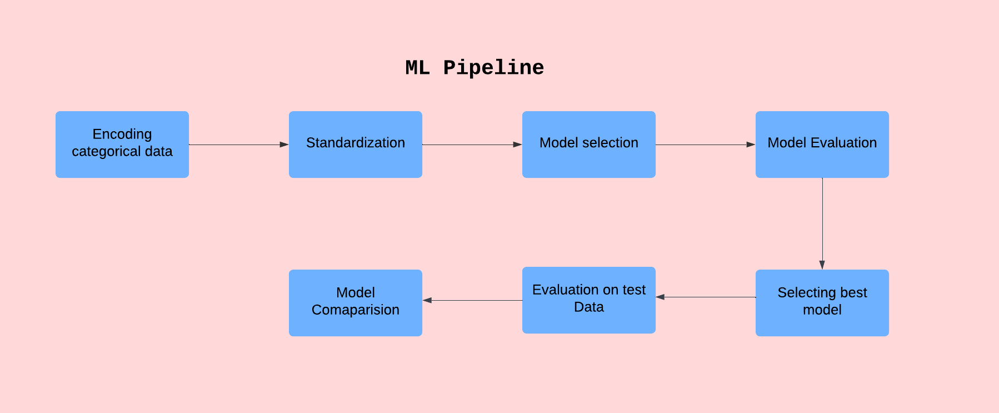
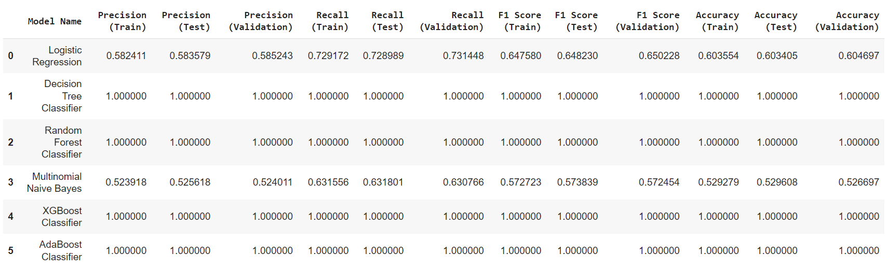

# Data_Mining_Project2_SNAPP

# [Creadit risk analysis](https://www.kaggle.com/datasets/rameshmehta/credit-risk-analysis)

# Introduction

In the GitHub repository, you will discover code and comprehensive documentation related to our Data Mining course project. Our project's primary focus revolves around conducting an in-depth exploratory data analysis (EDA) and developing classification models. Our objective is to offer a thorough comprehension of the dataset we have at hand, as well as construct and evaluate  models through a systematic approach. This project serves as a valuable opportunity for us to gain hands-on experience in handling data, preparing it for analysis by addressing data cleaning tasks, and systematically building and refining regression models. This practical endeavor enriches our understanding and expertise in the realm of data analysis and modeling.

# TEAM 21 SNAPP

### - Priyanka Lalwani - 202218058
### - Sakshi Parihar - 202218042
### - Anisha Anilkumar - 202218038
### - Prachi Shah - 202218027
### - Nandini Parekh - 202001455

# Project Pipeline

# Table of Contents

## [ 1. Dataset description ](#1-dataset-description)
## [ 2. Data Preprocessing and Data Visualisation ](#2-data-preprocessing-and-data-visualisation)
## [ 3. Machine Learning Pipeline ](#3-machine-learning-pipeline)
## [ 4. Conclusion ](#4-conclusion)

## 1. Dataset description

The 'Credit Risk Analysis' dataset, available on Kaggle, encompasses a comprehensive collection of data pertinent to loans, borrowers, and their credit profiles. This dataset is meticulously curated for tasks involving the analysis and prediction of credit risk, with a specific focus on assessing and forecasting the likelihood of loan defaults. It serves as a valuable resource for honing data cleaning and exploratory data analysis (EDA) skills, as well as for constructing classification models aimed at predicting loan defaults based on an array of borrower attributes and loan characteristics. By delving into this dataset, data enthusiasts and machine learning practitioners gain hands-on experience in the realm of credit risk assessment, making it an ideal resource for learning and practical application.

Atrributes :- 

'funded_amnt' : The total amount funded for the loan.

'term' : The term length of the loan (e.g., 36 months, 60 months).

'int_rate' : The interest rate on the loan.

'installment' : The monthly installment payment.

'grade' : A rating assigned to the loan based on creditworthiness.

'sub_grade' : A sub-rating within a grade.

'home_ownership' : The type of home ownership (e.g., RENT, OWN).

'annual_inc' : The annual income of the borrower.

'verification_status': The status of income verification.

'purpose': The purpose of the loan (e.g., credit_card, car, home_improvement).

'dti': Debt-to-Income ratio.

'delinq_2yrs' : The number of 30+ days delinquencies in the borrower's credit file.

'inq_last_6mths': The number of inquiries in the last 6 months.

'open_acc' : The number of open credit lines in the borrower's credit file.

'pub_rec' : The number of derogatory public records.

'revol_bal' : The borrower's revolving balance (credit card balance).

'revol_util' : The percentage of credit used by the borrower.

'total_rec_late_fee' : The total late fees received.

'collections_12_mths_ex_med' : Number of collections in the last 12 months, excluding medical collections.

'application_type' : The type of application (e.g., INDIVIDUAL, JOINT).

'acc_now_delinq' : The number of accounts currently delinquent.

'tot_coll_amt': Total collection amounts ever owed.

'tot_cur_bal' : Total current balance of all accounts.

'default_ind' : The target variable indicating loan default (1 for default, 0 for non-default).

## 2. Data Preprocessing
and Data Visualisation 

### Data Preprocessing

During the preprocessing stage, we initiated the dataset by loading it and conducted a comprehensive assessment to identify missing values, both in the form of 'NA' and 'NaN'. We systematically addressed these missing values in the following ways:

-Feature Removal: Features with excessive missing values, surpassing the 75% threshold, were prudently eliminated from the dataset. This approach was adopted to maintain data quality and streamline subsequent analysis, acknowledging that these columns lacked the data density required for meaningful insights.

-Handling the 'desc' Column: Recognizing that the 'desc' column likely contained textual data, which wasn't within the scope of our analysis, we opted to remove this column. Text data often necessitates specialized processing, which was beyond the current project's focus.

-Imputing Numeric Values: For certain numeric columns, missing values were imputed using either the mean or median values. This practice ensured the integrity of the dataset by substituting missing entries with representative central tendencies.

-Categorical Data Treatment: Categorical columns posed unique challenges. To preserve the categorical nature of the data while addressing missing values, we assigned designated categorical labels or names to replace these gaps.

These preprocessing steps were carefully executed to prepare the dataset for in-depth analysis, guaranteeing its cleanliness and completeness, and facilitating subsequent exploratory and modeling tasks.

### Data Visualization

-During our thorough exploratory data analysis (EDA), we conducted an in-depth examination of the factors influencing our target variable, the default indicator. This comprehensive analysis yielded valuable insights that are pivotal in understanding credit risk.

-First, we observed a significant impact of loan term on default rates. Loans with a 5-year term exhibited a notably higher default rate compared to those with a 3-year term, indicating a relationship between extended loan durations and increased default risk.

-Second, as the loan grade increased, there was a corresponding rise in the default rate. This underscores the strong association between loan grade and default risk, with higher-grade loans posing a heightened risk of default.

-In terms of home ownership, our analysis revealed that borrowers who own or rent homes had a lower default rate compared to those with no home ownership. This highlights the potential influence of stable housing arrangements on reducing default risk.

-Additionally, debt-to-income ratio (DTI) played a pivotal role. Borrowers with DTIs in the 20-35 range exhibited a higher likelihood of default, emphasizing the significance of managing debt relative to income.

-Finally, we found a positive correlation between higher revolving utilization (reliance on credit) and an elevated likelihood of default. This underscores the importance of responsible credit management, as borrowers who heavily rely on their available credit lines are at a heightened risk of default.

-These insights, substantiated by compelling visualizations in our EDA, provide actionable guidance for credit risk assessment, lending decisions, and the development of effective risk mitigation strategies. They equip us with the knowledge to make informed, data-driven decisions to minimize the risk of loan defaults.

## 3. Machine Learning Pipeline

Models:

Logistic Regression:
Logistic Regression is a linear model used for binary classification problems.
Key Parameters:
penalty: Regularization term ('l1', 'l2', or None).
C: Inverse of regularization strength.
solver: Algorithm to use for optimization.
max_iter: Maximum number of iterations.
Decision Tree Classifier:

Decision Trees are non-linear models that create a tree structure for classification problems.
Key Parameters:
criterion: The function used to measure the quality of a split ('gini' or 'entropy').
max_depth: The maximum depth of the tree.
min_samples_split: The minimum number of samples required to split an internal node.
min_samples_leaf: The minimum number of samples required to be at a leaf node.
Random Forest Classifier:

Random Forest is an ensemble of Decision Trees.
Key Parameters:
n_estimators: The number of trees in the forest.
max_depth: The maximum depth of the tree.
min_samples_split: The minimum number of samples required to split an internal node.
min_samples_leaf: The minimum number of samples required to be at a leaf node.

Multinomial Naive Bayes:
Naive Bayes is a probabilistic model based on Bayes' theorem. Multinomial Naive Bayes is suitable for text classification.
Key Parameters:
alpha: Laplace smoothing parameter.
fit_prior: Whether to learn class prior probabilities from the data.

XGBoost Classifier:
XGBoost is a gradient boosting algorithm that can handle various types of data.
Key Parameters:
n_estimators: The number of boosting rounds.
learning_rate: Step size shrinkage to prevent overfitting.
max_depth: Maximum depth of the decision tree.

AdaBoost Classifier:
AdaBoost is an ensemble method that focuses on improving the classification of weak learners.
Key Parameters:
n_estimators: The number of weak learners to train.
learning_rate: The contribution of each weak learner.

## 4. Conclusion

-Logistic Regression:Precision, recall, F1 score, and accuracy values are relatively lower, indicating that the model's performance may not be ideal for the given dataset.

-Decision Tree Classifier, Random Forest Classifier, XGBoost Classifier, and AdaBoost Classifier
All of these tree-based models have perfect precision, recall, F1 score, and accuracy on the training, testing, and validation datasets. This might be a sign of overfitting, especially if the Decision Tree model has a high max depth.
Further tuning or cross-validation is recommended to determine if the models generalize well.

-Multinomial Naive Bayes:
This model shows decent but not perfect precision, recall, F1 score, and accuracy values.
It performs better than Logistic Regression, but there is still room for improvement.

-Overall, it's important to consider overfitting, data preprocessing, and hyperparameter tuning when interpreting these results. Further evaluation, such as cross-validation, can help ensure that the models perform well on unseen data.

